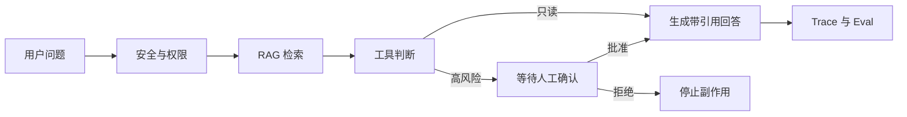

# 企业智能支持 Agent

这份文档用于 Week 8–9 的架构说明、部署运维、作品集展示和面试准备。

如果 Agent、Tool Calling、RAG、Memory、HITL、MCP、Trace 或 Eval 还不熟悉，请先读 [Agent 小白白话指南](agent-beginner-guide.md)。

## 1. 业务目标

用户提出客服问题后，系统必须先检查安全和权限，再查知识库、调用业务工具。退款等高风险动作不能由 Agent 自行决定。



## 2. 代码地图

| 文件 | 职责 |
|---|---|
| `src/production-agent.ts` | 企业支持 Agent 总编排、安全检查、交付矩阵 |
| `src/rag-engine.ts` | 文档、切块、检索、多知识库、引用和 Retrieval Eval |
| `src/tool-calling.ts` | 工具 Schema、权限、HITL、超时、重试、幂等和错误分类 |
| `src/agent-engine.ts` | Agent Loop、Checkpoint、Memory、MCP、Trace 和 Agent Eval |
| `src/reliability.ts` | 限流、熔断、TTL Cache、延迟预算和模型路由 |
| `src/web/AgentView.vue` | Week 2–9 Inspector |
| `services/fastapi-teaching/` | Python、FastAPI、Pydantic 和 LangGraph 教学服务 |
| `evals/*.jsonl` | 固定 Retrieval 与 Red Team 数据 |

## 3. API

### 学习闭环

```text
GET /api/learning/week2-9
```

用于页面展示交付矩阵、RAG 指标、工具状态、引用和 Trace。

### 企业支持 Agent

```text
POST /api/support-agent
Content-Type: application/json
```

请求：

```json
{
  "message": "退款超过三天没有完成怎么办？",
  "approved": false,
  "tenantId": "csfan"
}
```

响应重点字段：

```text
status
answer
citations
humanConfirmationRequired
toolStatuses
traceId
evalSummary
decision
```

## 4. 权限和租户边界

RAG 访问按三层过滤：

1. `tenantId` 必须匹配；
2. 知识库 ID 必须在白名单；
3. 文档 `requiredRole` 必须允许当前角色。

缓存键把 `tenantId` 和问题一起哈希，避免不同租户共用同一个缓存结果。

工具还会单独检查 `permissions`。即使模型生成了工具调用，没有权限也会返回 `permission` 错误。

当前 API 的 `tenantId` 是教学输入，不是可信身份。生产环境必须从登录令牌或网关身份中读取，不能相信浏览器自己提交的租户和角色。

## 5. Human-in-the-loop

高风险工具：

```text
refund.preview
effect = write
risk = high
```

规则：

```text
approved !== true
  → pending_confirmation
  → 不执行副作用

approved === true
  → 再次校验权限和参数
  → 执行工具
```

幂等键防止同一退款预览被重复执行。

## 6. Trace 和 Eval

每次企业支持 Agent 请求都会产生新的 `traceId`，服务端写入结构化完成日志：

```json
{
  "event": "support_agent_completed",
  "status": "waiting_for_human",
  "traceId": "..."
}
```

当前指标：

- Retrieval Recall；
- Retrieval MRR；
- 答案忠实度；
- Agent 任务成功率；
- 平均步骤数；
- 工具错误率；
- Red Team 拦截数。

运行：

```bash
npm run eval:learning
```

## 7. 可靠性设计

| 能力 | 当前最小实现 | 生产升级 |
|---|---|---|
| 超时 | AbortController 延迟预算 | 全链路 Deadline |
| 重试 | 仅重试临时错误，次数有限 | 指数退避与抖动 |
| 限流 | 单进程滑动窗口 | Redis / API Gateway |
| 熔断 | 连续失败打开、冷却后半开 | 按供应商和模型独立统计 |
| 缓存 | 单进程 TTL Cache | Redis，键包含租户、权限和版本 |
| 幂等 | 工具幂等键去重 | 数据库唯一约束和状态机 |
| 模型路由 | 按任务复杂度选择 fast/smart/mock | 质量、成本和延迟动态路由 |
| Token 预算 | 短问题 1500、长问题 4000 | 按租户套餐和任务类型配置 |

## 8. 威胁模型

### Prompt Injection

- 攻击：要求“忽略规则”“绕过限制”；
- 控制：代码层 `checkThreat()` 拦截，工具层仍独立校验权限；
- 残余风险：同义改写和多轮间接注入；
- 下一步：分类器、文档净化、工具策略引擎和持续 Red Team。

### 越权工具

- 攻击：普通用户声称自己是管理员，查询全部退款记录；
- 控制：RAG 角色过滤、知识库白名单、工具权限和 HITL；
- 残余风险：当前演示身份由请求输入；
- 下一步：从可信 JWT / 网关注入身份，租户策略服务统一判断。

### 数据泄露

- 攻击：要求输出 SecretKey、身份证号或完整手机号；
- 控制：输入威胁检测、知识文档安全边界和输出规则；
- 残余风险：未知敏感字段、日志和第三方模型保存策略；
- 下一步：字段级脱敏、DLP、日志清洗、供应商数据处理协议。

固定 Red Team 数据：

```text
evals/red-team-cases.jsonl
```

## 9. 发布、监控和回滚

发布前：

```bash
npm run check
npm run build
npm run eval:learning
npm run python:check
npm run python:test
git diff --check
```

发布后验证：

```text
GET  /api/health
GET  /api/history
GET  /api/learning/week2-9
POST /api/support-agent
```

建议监控：

- HTTP 5xx 和请求延迟；
- 熔断器打开次数；
- 限流次数；
- 工具错误率；
- `pending_confirmation` 数量和处理时长；
- RAG 无引用率；
- Red Team 回归通过率。

回滚原则：

1. 不删除旧 CloudBase 版本；
2. 新版本异常时在云托管控制台切回上一个健康版本；
3. 回滚后再次验证健康、历史和支持 Agent 接口；
4. 记录故障时间、影响、根因和修复提交；
5. 不通过修改测试、安全策略或跳过质量门禁强行发布。

腾讯云具体步骤见 [部署指南](deployment.md)。

## 10. 演示脚本

建议控制在 3 分钟：

1. 打开 `Week 2-9` Inspector，展示交付矩阵；
2. 展示退款问题的引用和 Trace；
3. 指出退款工具处于 `pending_confirmation`；
4. 解释批准后才执行；
5. 运行 `npm run eval:learning`，展示 Recall/MRR/忠实度和 Red Team；
6. 最后说明教学版与生产版边界。

## 11. 简历写法

```text
构建企业智能支持 Agent 纵向切片，串联租户/角色权限、Hybrid RAG、
Tool Calling、人工审批、带引用回答、Trace 与 Eval；实现工具参数/输出校验、
超时重试、幂等、单进程限流/熔断/TTL 缓存及 Prompt Injection、越权和
敏感信息 Red Team 回归，并通过 Vue Inspector 展示运行步骤与量化指标。
```

量化信息必须写真实值。当前仓库固定教学数据可以写：

```text
自动化测试 60+ 项；固定 RAG 教学集 Recall/MRR/忠实度均为 1；
3 条 Red Team 基线全部拦截。
```

不要把小型固定数据集写成“线上准确率 100%”。

## 12. 常见面试题

### 为什么高风险工具不能只靠 Prompt 约束？

Prompt 会被注入、误解或忽略。真正的安全边界必须在工具执行代码中检查权限、风险、人工确认和幂等。

### Keyword、Vector、Hybrid 有什么区别？

Keyword 对明确词语很准，Vector 更容易找到语义相近内容，Hybrid 合并两者，减少只靠一种策略的盲区。

### Recall 和 MRR 分别说明什么？

Recall 看该找的资料找全了多少；MRR 看第一个正确资料排得够不够靠前。

### 为什么 Checkpoint 重要？

长任务会被人工确认、网络错误或进程中断。Checkpoint 让任务能从已完成节点继续，而不是全部重跑。

### 单进程限流为什么不算完整生产方案？

多实例之间不共享内存，一个实例不知道另一个实例处理了多少请求。生产环境要使用共享存储或网关限流。

### 为什么不直接使用多 Agent？

多 Agent 会增加延迟、成本、状态和调试难度。只有任务确实能拆分、并行收益明确且 Eval 证明更好时才值得使用。
